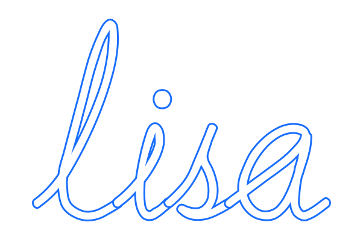

    

    A <em>focus assistant</em> that doesn't suck. 
    Work better, focus longer.

    <a href="#why"><strong>Why?</strong></a> ·
    <a href="#principles"><strong>Features</strong></a><!-- ·
    <a href="./Contributing.md"><strong>Chrome Webstore</strong></a-->

Lisa extends your focus by helping you break down work into manageable time 
intervals separated by short breaks.

    

## Why?

Why create Lisa? I couldn't find a focus timer that ticked all the boxes I had.
I wanted:
1. To easily extend the a time interval or break on the fly.
2. To have a visual reminder that I'm focusing.
3. To quickly manipulate timer controls without switching from my browser
window or tab.

## Features
1. **Persistance on the screen.** Unlike other timers I've used, with Lisa 
you're less likely to forget to start the timer while focusing, or suddenly
realize you've been distracted for hours since the timer is visible in all 
tabs by default. However, it can be deliberately hidden for a specific tab. 

2. **Extend timer.** Sometimes you're 95% done and you don't need another 
focus interval to complete the task. Just extend the timer for <em>n</em> minutes 
and get your work done after the current interval is over. To extend the timer
while an interval is running, visit the <em>Settings</em> page.

3. **Configurable focus, short break and long break intervals.** We all have
different focusing abilities. Configure the timer to your preferred intervals. 
By default focus intervals are 50 minutes, short breaks 10 minutes and long
breaks 30 minutes. Fifty-minute focus intervals are long enough to get into
a flow state and get plenty done, but short enough to sustain attention with 
some practice.

### License
Lisa is MIT-licensed.
